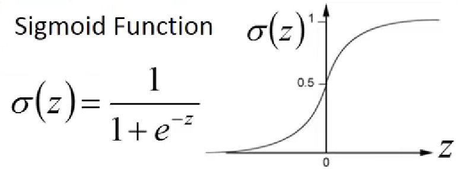

## Logistic Regression 逻辑回归
### Step1. Function Set
+ **Sigmoid Function**  

  
+ **Logistic Regression**  
$$ f_{w,b}(x)=\sigma(\sum_iw_ix_i+b) $$  
output:between 0 and 1  
+ **Linear Regression**  
$$ f_{w,b}(x)=\sum_iw_ix_i+b $$  
output:any value  

### Step2. Goodness of a Function  
+ **Logistic Regression**  
Training data:($x^n,\hat{y}^n$)  
$\hat{y}^n$:1 for class1,0 for class2  
$$ L(f)=\sum_nC(f(x_n),\hat{y}^n)$$  
$$ C(f(x_n),\hat{y}^n)=-[\hat{y}^nlnf(x_n)+(1-\hat{y}^n)ln(1-f(x_n))] $$  
+ **Linear Regression**  
Training data:($x^n,\hat{y}^n$)  
$\hat{y}^n$:a real number    
$$ L(f)=\frac{1}{2}\sum_nC(f(x_n)-\hat{y}^n)^2$$

### Step3. Find the best function  
